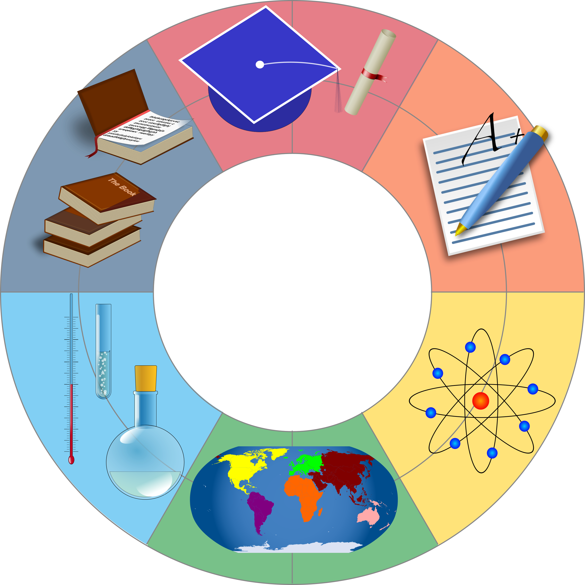

<html>
 <head>
    <title> JEHB Physics </title>
    
</head>

<body>
    <section class="firstsection">
        

            
 
                <h1 class="text-big" id="web"> AP Physics C Units</h1>
                <a href="https://bgt072105.github.io/CSA-tri1-teamrepo/jupyter/2022/11/02/Kinematics.html"><button class="btn btn-sm"> Kinematics</button> </a>
                <a href="https://bgt072105.github.io/CSA-tri1-teamrepo/jupyter/2022/11/02/NewtonsLaws.html"><button class="btn btn-sm"> Newton's Laws</button> </a>
                <a href="https://bgt072105.github.io/CSA-tri1-teamrepo/jupyter/2022/11/02/Gravitation.html"><button class="btn btn-sm"> Gravitation</button> </a>
                <a href=" https://bgt072105.github.io/CSA-tri1-teamrepo/jupyter/2022/11/02/Electricforces.html"><button class="btn btn-sm"> Electric Forces</button> </a>
                <a href="https://bgt072105.github.io/CSA-tri1-teamrepo/physicsflashcards/"><button class="btn btn-sm"> Study Flashcards </button> </a>
            

            

                
            

        

    </section>
</body>
</html>